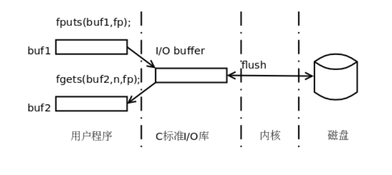

# 标准IO(`stdio`)缓冲

**标准IO缓冲是用户空间中由标准库`stdio`中函数实现的IO缓冲。**

对于系统中的缓冲层次，大致如下图所示：



其中，**用户程序、标准IO库都处于用户空间，用户程序可以自定义缓冲区，`stdio`也有其缓冲区。**

## 一、标准IO(`stdio`)缓冲的3种机制

标准IO缓冲的3种机制：

+ **无缓冲** (unbuffered): **标准错误输出是无缓冲的，调用的是read，write。**
+ **全缓冲** (块缓冲) (block  buffered)：**文件操作默认都是使用全缓冲，而块是文件操作的基本单位，缓冲完成后调用的是read或write。**
+ **行缓冲**(line buffered)：**与==终端相关的操作，如标准输入与标准输出都是行缓冲。==缓冲完成后调用的是read或write。**

通常文件系统的块的大小为512字节的整数倍。

**==文件操作使用全缓冲，目的是进行块对齐，减少块空间的浪费、系统调用次数与磁盘IO次数。==**最明显的例子如下：

```bash
dd if=/dev/zero of=./a bs=1 count=2097152
dd if=/dev/zero of=./a bs=4096 count=512
#下面的时间耗费明显小于上面的，这是因为缓冲区的存在减少了系统调用次数与磁盘IO次数
```


## 二、设置`stdio`流的缓冲模式

调用`setvbuf()`库函数，可以设置`stdio`库改变指定文件流使用缓冲的形式：

```c
// stream是文件流指针
// buf是指定的缓冲区，若buf为NULL，则stdio库会为stream自动分配一个缓冲区
// 如果buf不为NULL，那么就会以指定的buf作为缓冲区，要求这个缓冲区在堆区，因此需要malloc或者calloc进行分配
// mode指定缓冲方式，有三个值：_IONBF无缓冲 _IOLBF行缓冲 _IOFBF全缓冲
// size为缓冲区大小
int setvbuf(FILE *stream, char *buf, int mode, size_t size);
// return 0 on success, or nozero on error
```


## 三、刷新`stdio`缓冲区

**`fflush()`库函数调用会==强制将`stdio`输出流中的数据(即通过write())刷新到内核缓冲区中==。**其函数原型如下：

```c
#include <stdio.h>
// 如果stream为NULL，则是刷新所有缓冲区
int fflush(FILE *stream);
```


## 四、关于终端的IO操作

**终端有与用户交互的缓冲，我们每一次在终端中的输入实际上都是有在终端中进行缓冲的，==在终端中调用其他程序，实际上是使用了一个`popen()`，这样我们在终端中进行输入时，一开始我们键入的数据是在终端缓冲区中的，之后被调用的程序会从管道中读取到这些数据。==**


**标准IO使用双拷贝：用户空间-》内核空间-》文件，文件-》内核空间-》用户空间**

**这种双拷贝实际上造成了性能的浪费**


直接IO，同步IO，异步IO

零拷贝技术

