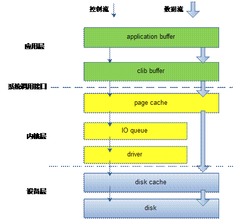

# `mmap()`实现高性能IO

**`mmap()`==内存映射IO适合实现大数据量级的数据拷贝操作。==**

## 一、IO的层次结构图与提升IO性能的理论基础

### 1.缓冲IO的表现与理论基础

其中，`application buffer`,`clib buffer`是用户空间的应用缓冲区和C标准库缓冲区。

`page cache`是内核层的缓冲区，`disk cache`是设备层的缓冲区。

这些**==缓冲区是为了减少跨层IO的次数而设立的==**，减少了用户态与内核态的切换、内核态发起磁盘IO的次数，进而节约了时间，提高了性能。

### 2.直接IO的理论基础

直接IO适用于自缓存的应用软件，比如数据库，绕过了内核层的缓冲区，**==减少了数据在用户地址空间和操作系统内核地址空间之间的数据拷贝操作,==**直接到磁盘上，这样减少了用户态与内核态的切换消耗。

### 3.内存映射IO(`mmap()`系统调用)

**内存映射IO也是==减少了跨层IO，减少了标准访问文件方式中read()系统调用所带来的数据拷贝操作，==即减少数据在用户地址空间和操作系统内核地址空间之间的数据拷贝操作。**

**内存映射适用与较大范围数据，==对于相同长度的数据来讲，映射所带来的开销远远低于CPU拷贝所带来的开销==。当大量数据需要传输的时候，采用内存映射方式去访问文件会获得比较好的效率。**

