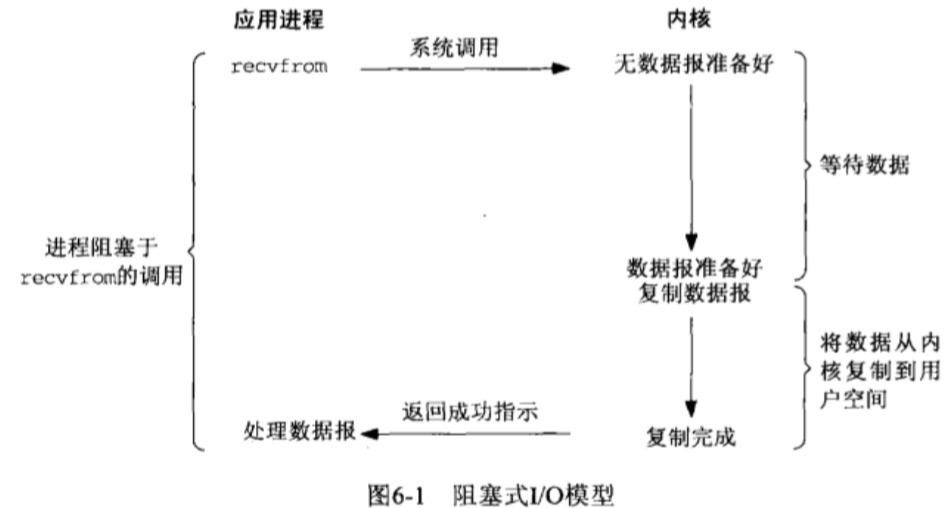
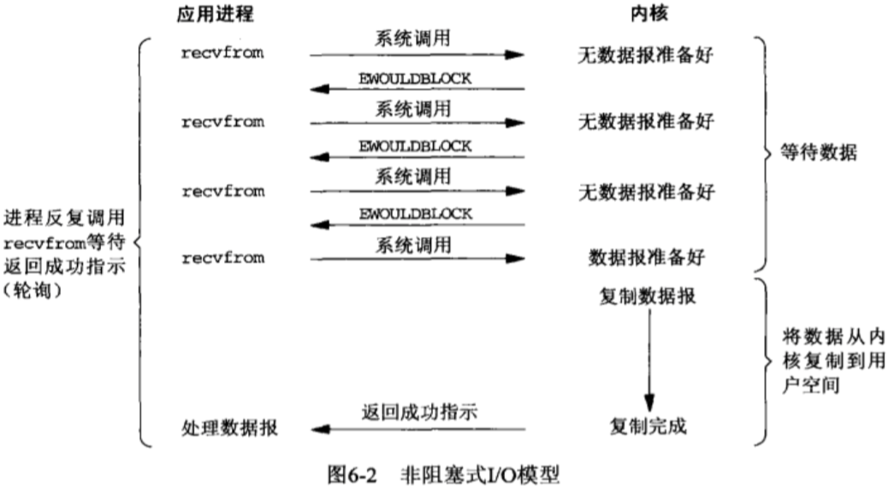

# 阻塞IO与非阻塞IO

一个IO操作可以分为两个步骤：

+ 发起IO请求
+ 实际的IO操作

使用read()函数读取本机文件是不会有阻塞的，**在读设备文件、管道或者网络的时候才会出现阻塞的情况。**

## 一、阻塞IO与非阻塞IO

**阻塞IO与非阻塞IO的区别在于第一步，发起IO请求是否会被阻塞**。如果阻塞到实际IO操作完成那么就是阻塞IO，如果不阻塞，那么就是非阻塞IO。

**阻塞和非阻塞的概念描述的是用户线程调用内核IO操作的方式：**

+ 阻塞是指IO请求被发起后，要等到IO操作彻底完成之后才返回到用户空间
+ 非阻塞是指IO请求被发起后立即返回给用户一个状态值，无需等到IO操作彻底完成

**阻塞IO的操作过程模型如下图所示：**

**非阻塞IO的操作过程模型如下：**

**使用read()进行非阻塞IO时，返回值为-1时，需要根据错误码判断是数据没有准备好还是真的出现了错误。**